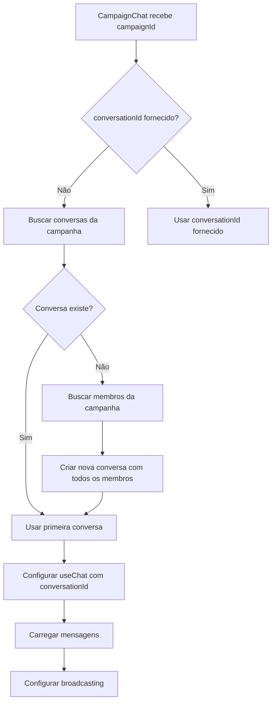

# Análise Profunda: Chat de Campaign

## 📋 Índice
1. [Visão Geral](#visão-geral)
2. [Arquitetura e Estrutura](#arquitetura-e-estrutura)
3. [Fluxo de Dados](#fluxo-de-dados)
4. [Funcionalidades Principais](#funcionalidades-principais)
5. [Integração com Sistema de Dados](#integração-com-sistema-de-dados)
6. [Broadcasting em Tempo Real](#broadcasting-em-tempo-real)
7. [Análise de Código](#análise-de-código)
8. [Problemas Identificados](#problemas-identificados)
9. [Recomendações de Melhorias](#recomendações-de-melhorias)
10. [Segurança e Validações](#segurança-e-validações)

---

## 1. Visão Geral

O **CampaignChat** é um componente React especializado para comunicação em campanhas de RPG. Ele combina funcionalidades de chat tradicional com um sistema integrado de rolagem de dados, tornando-se uma ferramenta completa para jogadores e mestres.

### Características Principais:
- ✅ Chat em tempo real com broadcasting (Laravel Echo/Pusher)
- ✅ Sistema de rolagem de dados integrado
- ✅ Upload de mídia (imagens, vídeos, documentos)
- ✅ Indicadores de digitação
- ✅ Detecção e renderização especial de mensagens de dados
- ✅ Criação automática de conversas de campanha

---

## 2. Arquitetura e Estrutura

### 2.1 Componente Principal

**Arquivo:** `resources/js/components/CampaignChat.jsx`

```
CampaignChat
├── useChat (hook de chat genérico)
│   ├── Gerenciamento de mensagens
│   ├── Broadcasting em tempo real
│   └── Indicadores de digitação
├── useDiceRoll (hook de rolagem de dados)
│   ├── Validação de fórmulas
│   ├── Comunicação com API
│   └── Fórmulas comuns
├── Estados Locais
│   ├── conversationId (estado interno)
│   ├── newMessage (input)
│   ├── Modais (dados, arquivo)
│   └── UI states
└── Lógica de Negócio
    ├── Busca/criação de conversa
    ├── Envio de mensagens
    ├── Integração de dados
    └── Renderização especial
```

### 2.2 Dependências e Hooks

**Hooks Utilizados:**
1. **useChat** (`resources/js/hooks/useChat.js`)
   - Gerencia mensagens, conversas e eventos em tempo real
   - Fornece: `messages`, `sendMessage`, `typingUsers`, etc.

2. **useDiceRoll** (`resources/js/hooks/useDiceRoll.js`)
   - Gerencia rolagens de dados da campanha
   - Fornece: `rollDice`, `validateFormula`, `parseFormula`, etc.

**Componentes Auxiliares:**
- `DiceRollMessage.jsx` - Renderização especializada de rolagens

---

## 3. Fluxo de Dados

### 3.1 Inicialização do Componente



### 3.2 Fluxo de Envio de Mensagem

```
1. Usuário digita mensagem → handleTyping()
2. Detecção de digitação → startTyping()
3. Enter ou botão → handleSendMessage()
4. sendMessage() do useChat
5. POST /api/chat/conversations/{id}/messages
6. Backend cria mensagem
7. Broadcasting: MessageSent event
8. Todos os participantes recebem via Echo
9. Hook atualiza state automaticamente
```

### 3.3 Fluxo de Rolagem de Dados

```
1. Usuário clica botão de dados
2. Modal abre → usuário insere fórmula
3. handleDiceRoll() valida fórmula
4. rollDice() do useDiceRoll
5. POST /api/campaigns/{id}/dice-rolls
6. Backend valida, rola e salva
7. Resposta com resultado
8. Mensagem formatada criada: "🎲 {nome} rolou {formula}: [{result}]"
9. sendMessage() envia mensagem formatada
10. Broadcasting distribui para todos
11. Renderização especial detecta emoji 🎲
12. DiceRollMessage component renderiza visual especial
```

---

## 4. Funcionalidades Principais

### 4.1 Sistema de Conversas

**Busca Automática:**
```javascript
// Se conversationId não fornecido, busca automaticamente
if (!conversationId && campaignId) {
    fetch(`/api/campaigns/${campaignId}/conversations`)
    // Usa primeira conversa encontrada
}
```

**Criação Automática:**
```javascript
// Se não existe conversa, cria com todos os membros
const createCampaignConversation = async () => {
    // 1. Busca membros da campanha
    // 2. Cria conversa incluindo todos
    // 3. Tipo: 'campaign'
}
```

**Problema Identificado:**
- ⚠️ Não há lógica para escolher qual conversa usar se houver múltiplas
- ⚠️ Sempre usa a primeira encontrada (linha 49)
- ⚠️ Não verifica se a conversa já está configurada corretamente

### 4.2 Sistema de Mensagens

**Carregamento:**
- Mensagens carregadas via `useChat` hook
- Paginação suportada (before/after)
- Ordenação: mais recente primeiro (desc)

**Envio:**
- Suporte a texto puro
- Suporte a mídia (imagens, vídeos, documentos)
- Formatação especial para rolagens de dados

**Renderização:**
```javascript
// Detecção de mensagem de dados
isDiceRollMessage(message) {
    return message.content.includes('🎲') && 
           message.content.includes('rolou');
}

// Parse de rolagem da mensagem
parseDiceRollFromMessage(message) {
    // Regex: 🎲 {nome} rolou {formula}: [{result}]
    // Extrai dados para componente especializado
}
```

### 4.3 Sistema de Rolagem de Dados

**Validação de Fórmula:**
```javascript
// Frontend (useDiceRoll.js)
validateFormula(formula) {
    const regex = /^[0-9]+[dD][0-9]+([+\-][0-9]+)?$/;
    return regex.test(formula);
}

// Backend (DiceRollService.php)
// Validações mais rigorosas:
// - Número de dados: 1-100
// - Lados: 2-1000
// - Modificador: -1000 a +1000
```

**Fórmulas Suportadas:**
- `1d20` - Um dado de 20 lados
- `2d6+3` - Dois dados de 6 lados + 3
- `3d4-1` - Três dados de 4 lados - 1

**Cálculo:**
```php
// DiceRollService::calculateRoll()
for ($i = 0; $i < $parsedFormula['dice']; $i++) {
    $roll = rand(1, $parsedFormula['sides']);
    $diceRolls[] = $roll;
    $total += $roll;
}
$total += $parsedFormula['modifier'];
```

**Armazenamento:**
```json
{
    "campaign_id": 1,
    "roller_id": 5,
    "formula": "2d6+3",
    "result": 12,
    "detail": {
        "dice_rolls": [4, 5],
        "modifier": 3,
        "description": "Ataque com espada",
        "formula_parsed": {
            "dice": 2,
            "sides": 6,
            "modifier": 3
        }
    }
}
```

### 4.4 Upload de Mídia

**Suportado:**
- Imagens: jpg, jpeg, png, gif
- Vídeos: mp4
- Áudio: mp3
- Documentos: pdf, doc, docx, txt

**Limite:** 10MB (configurado no MessageController)

**Fluxo:**
```javascript
handleFileSelect() → selectedFile state
handleFileUpload() → FormData com arquivo
POST /api/chat/conversations/{id}/messages (multipart/form-data)
ChatService::storeMessageMedia() → Storage
URL retornada → salva em message.media_url
```

### 4.5 Indicadores de Digitação

**Funcionamento:**
```javascript
handleTyping() {
    if (value.trim() && !isTyping) {
        startTyping(); // POST /typing endpoint
        setIsTyping(true);
    } else if (!value.trim() && isTyping) {
        stopTyping();
    }
}
```

**Timeout Automático:**
- useChat hook gerencia timeout de 3 segundos
- Para automaticamente após inatividade

**Broadcasting:**
- Evento `UserTyping` disparado
- Canal privado: `conversation.{id}`
- Todos os participantes veem indicador

---

## 5. Integração com Sistema de Dados

### 5.1 Separação de Sistemas

O sistema de rolagem de dados é **independente** do sistema de mensagens:

**Sistema de Dados:**
- Tabela: `dice_rolls`
- API: `/api/campaigns/{id}/dice-rolls`
- Serviço: `DiceRollService`
- Controller: `DiceRollController`

**Sistema de Mensagens:**
- Tabela: `messages`
- API: `/api/chat/conversations/{id}/messages`
- Serviço: `ChatService`
- Controller: `MessageController`

### 5.2 Integração no Chat

**Abordagem Atual:**
1. Usuário rola dados → API de dados retorna resultado
2. Frontend formata mensagem: `🎲 {nome} rolou {formula}: [{result}]`
3. Mensagem enviada via sistema de chat normal
4. Chat detecta padrão e renderiza componente especial

**Vantagens:**
- ✅ Histórico unificado no chat
- ✅ Buscável junto com mensagens
- ✅ Broadcasting automático

**Desvantagens:**
- ⚠️ Dados não persistem no histórico de rolagens se não enviados
- ⚠️ Parse baseado em regex (pode quebrar com formato diferente)
- ⚠️ Dependência de emoji específico

### 5.3 Detecção e Renderização

**Detecção:**
```javascript
isDiceRollMessage(message) {
    return message.content?.includes('🎲') && 
           message.content?.includes('rolou');
}
```

**Parse:**
```javascript
parseDiceRollFromMessage(message) {
    const match = message.content.match(
        /🎲 (.+?) rolou (.+?): \[(\d+)\](?: - (.+))?/
    );
    // Extrai: nome, formula, result, description
}
```

**Problemas:**
- ⚠️ Regex pode falhar com formatos não esperados
- ⚠️ Não valida se realmente é uma rolagem válida
- ⚠️ Se usuário digitar manualmente formato similar, será renderizado como dados

**Componente de Renderização:**
```javascript
<DiceRollMessage 
    roll={parsedRollData}
    showDetails={true}
/>
```

Features do `DiceRollMessage`:
- ✅ Cores especiais para críticos (verde) e falhas (vermelho)
- ✅ Ícones diferentes por tipo de dado
- ✅ Detalhes da rolagem (cada dado individual)
- ✅ Descrição opcional

---

## 6. Broadcasting em Tempo Real

### 6.1 Eventos Utilizados

**Eventos Laravel:**
1. `MessageSent` - Nova mensagem enviada
2. `UserTyping` - Usuário digitando
3. `UserJoinedConversation` - Usuário entrou
4. `UserLeftConversation` - Usuário saiu

**Canais:**
- Canal privado: `conversation.{conversation_id}`
- Autenticação via Laravel Echo

### 6.2 Configuração no Hook useChat

```javascript
useEffect(() => {
    if (!echo || !currentConversation) return;
    
    const channel = echo.private(`conversation.${currentConversation.id}`);
    
    // Eventos configurados:
    channel.listen('message.sent', ...);
    channel.listen('user.typing', ...);
    channel.listen('user.joined', ...);
    channel.listen('user.left', ...);
    
    // Cleanup ao desmontar
    return () => { ... };
}, [echo, currentConversation]);
```

### 6.3 Problemas Identificados

**Performance:**
- ⚠️ Canal reconfigurado toda vez que `currentConversation` muda
- ⚠️ Possível vazamento de memória se cleanup não funcionar
- ⚠️ Múltiplos listeners podem ser criados

**Sincronização:**
- ⚠️ Mensagem pode aparecer duplicada se backend e broadcasting enviarem
- ⚠️ Não há verificação de duplicatas
- ⚠️ Ordem pode ficar incorreta se mensagens chegarem fora de ordem

---

## 7. Análise de Código

### 7.1 Pontos Fortes

✅ **Separação de Responsabilidades:**
- Hooks especializados (useChat, useDiceRoll)
- Componente focado em UI e orquestração

✅ **Reutilização:**
- useChat usado em múltiplos contextos
- DiceRollMessage componente isolado

✅ **UX:**
- Loading states claros
- Error handling
- Estados vazios informativos

### 7.2 Problemas de Código

#### 7.2.1 Gerenciamento de Estado

**Problema 1: Estados duplicados**
```javascript
const [conversationId, setConversationId] = useState(propConversationId);
// E também usa currentConversation do useChat
```

**Problema 2: useEffect conflitantes**
```javascript
// Duas configurações de conversa podem executar simultaneamente
useEffect(() => { /* busca conversa */ }, [campaignId, propConversationId]);
useEffect(() => { /* configura conversa */ }, [conversationId]);
```

#### 7.2.2 Tratamento de Erros

```javascript
// Erros silenciosos em múltiplos lugares
catch (error) {
    console.error('Erro...', error);
    // Não informa usuário
    // Não tenta recuperar
    // Não atualiza UI
}
```

#### 7.2.3 Validações

**Frontend vs Backend:**
```javascript
// Frontend (useDiceRoll.js)
validateFormula(formula) {
    const regex = /^[0-9]+[dD][0-9]+([+\-][0-9]+)?$/;
    return regex.test(formula); // Muito permissivo
}

// Backend (DiceRollService.php)
// Validações mais rigorosas + limites numéricos
// Inconsistência pode causar erros no backend
```

#### 7.2.4 Parsing de Mensagens

```javascript
// Parse baseado em regex frágil
const match = message.content.match(/🎲 (.+?) rolou (.+?): \[(\d+)\](?: - (.+))?/);

// Problemas:
// - Nome pode conter "rolou"
// - Fórmula pode ter caracteres especiais
// - Regex não valida estrutura
```

### 7.3 Dependências Circulares

**Risco de Loop:**
```javascript
// useEffect 1: busca conversa → setConversationId
// useEffect 2: conversationId muda → setCurrentConversation
// useChat: currentConversation muda → busca mensagens
// Possível loop se dependências não estiverem corretas
```

---

## 8. Problemas Identificados

### 8.1 Problemas Críticos

🔴 **CRÍTICO 1: Race Condition na Criação de Conversa**
```javascript
// Se múltiplos usuários abrirem o chat simultaneamente,
// múltiplas conversas podem ser criadas
if (!conversationId && campaignId) {
    fetch(...).then(data => {
        if (data.data.length === 0) {
            createCampaignConversation(); // Sem lock!
        }
    });
}
```

🔴 **CRÍTICO 2: Falta de Validação de Permissão**
```javascript
// Não verifica se usuário é membro antes de criar conversa
const createCampaignConversation = async () => {
    // Busca membros mas não verifica se usuário atual está incluído
}
```

🔴 **CRÍTICO 3: Parse de Mensagem Frágil**
```javascript
// Se mensagem for editada ou formato mudar, parse quebra
parseDiceRollFromMessage(message) {
    // Regex pode falhar silenciosamente
}
```

### 8.2 Problemas de Performance

🟡 **PERFORMANCE 1: Múltiplas Requisições**
```javascript
// Ao inicializar:
// 1. Busca conversas
// 2. Se não existe, busca membros
// 3. Cria conversa
// 4. Busca mensagens
// Poderia ser otimizado com uma requisição
```

🟡 **PERFORMANCE 2: Re-renders Desnecessários**
```javascript
// Mensagens adicionadas no início do array
setMessages(prev => [data.message, ...prev]);
// Causa re-render de TODAS as mensagens
// Poderia usar virtualização
```

🟡 **PERFORMANCE 3: Scroll Automático Excessivo**
```javascript
useEffect(() => {
    messagesEndRef.current?.scrollIntoView({ behavior: 'smooth' });
}, [messages]); // Executa a cada mudança em messages
// Deveria verificar se é nova mensagem
```

### 8.3 Problemas de UX

🟡 **UX 1: Falta de Feedback**
- Erros apenas no console
- Usuário não sabe quando algo falhou
- Loading states podem ser confusos

🟡 **UX 2: Modal de Upload Confuso**
- Modal aparece após seleção
- Deveria ter preview inline
- Falta validação visual de tamanho/tipo

🟡 **UX 3: Modal de Dados Complexo**
- Muitas opções podem confundir
- Fórmulas comuns poderiam ser mais visíveis
- Falta validação em tempo real da fórmula

---

## 9. Recomendações de Melhorias

### 9.1 Refatorações Prioritárias

#### **1. Centralizar Gerenciamento de Conversa**

```javascript
// Criar hook useCampaignConversation
const useCampaignConversation = (campaignId) => {
    const [conversation, setConversation] = useState(null);
    const [loading, setLoading] = useState(true);
    
    useEffect(() => {
        // Lógica unificada de busca/criação
        // Com tratamento de race conditions
    }, [campaignId]);
    
    return { conversation, loading };
};
```

#### **2. Melhorar Parse de Mensagens**

**Opção A: Metadados na Mensagem**
```javascript
// Ao enviar rolagem, adicionar metadata
{
    content: "🎲 João rolou 1d20: [15]",
    metadata: {
        type: "dice_roll",
        dice_roll_id: 123
    }
}
```

**Opção B: Mensagem Separada**
```javascript
// Criar tipo de mensagem especial
{
    type: "dice_roll",
    dice_roll_data: { ... }
}
```

#### **3. Validação Unificada**

```javascript
// Criar utilitário compartilhado
// diceValidator.js (usado por frontend e backend)
export const validateFormula = (formula) => {
    // Validação idêntica em ambos os lados
};
```

### 9.2 Melhorias de Performance

#### **1. Virtualização de Mensagens**
```javascript
import { useVirtualizer } from '@tanstack/react-virtual';

const virtualizer = useVirtualizer({
    count: messages.length,
    getScrollElement: () => parentRef.current,
    estimateSize: () => 50,
});
```

#### **2. Debounce de Scroll**
```javascript
const scrollToBottom = useMemo(
    () => debounce(() => {
        messagesEndRef.current?.scrollIntoView({ behavior: 'smooth' });
    }, 100),
    []
);
```

#### **3. Cache de Conversa**
```javascript
// Usar React Query ou SWR
const { data: conversation } = useSWR(
    campaignId ? `/api/campaigns/${campaignId}/conversations` : null,
    { revalidateOnFocus: false }
);
```

### 9.3 Melhorias de UX

#### **1. Toast Notifications**
```javascript
// Substituir console.error por toasts
import { toast } from 'react-hot-toast';

catch (error) {
    toast.error('Erro ao enviar mensagem. Tente novamente.');
}
```

#### **2. Preview Inline de Arquivos**
```javascript
// Mostrar preview antes de enviar
{selectedFile && (
    <div className="preview-container">
        {/* Preview baseado no tipo */}
    </div>
)}
```

#### **3. Validação em Tempo Real de Fórmula**
```javascript
const [formulaError, setFormulaError] = useState(null);

useEffect(() => {
    if (!validateFormula(diceFormula)) {
        setFormulaError('Fórmula inválida');
    } else {
        setFormulaError(null);
    }
}, [diceFormula]);
```

### 9.4 Melhorias de Segurança

#### **1. Verificação de Permissões**
```javascript
const createCampaignConversation = async () => {
    // Verificar se usuário é membro ANTES de criar
    const membership = await checkMembership(campaignId);
    if (!membership) {
        throw new Error('Você não é membro desta campanha');
    }
    // ...
};
```

#### **2. Rate Limiting no Frontend**
```javascript
const [isSending, setIsSending] = useState(false);

const handleSendMessage = async (e) => {
    if (isSending) return; // Previne spam
    setIsSending(true);
    // ...
    setIsSending(false);
};
```

#### **3. Sanitização de Input**
```javascript
// Sanitizar mensagens antes de enviar
import DOMPurify from 'dompurify';

const sanitizedMessage = DOMPurify.sanitize(newMessage);
```

---

## 10. Segurança e Validações

### 10.1 Validações Backend

✅ **Validações Existentes:**
- Fórmula de dados: regex + limites numéricos
- Tamanho de arquivo: 10MB máximo
- Tipos de arquivo: allowlist
- Permissões: verificação de membro da campanha

### 10.2 Validações Frontend

⚠️ **Validações Faltando:**
- Não valida se usuário é membro antes de criar conversa
- Não valida tamanho de arquivo no frontend
- Validação de fórmula menos rigorosa que backend

### 10.3 Vulnerabilidades Potenciais

🔴 **XSS em Mensagens:**
```javascript
// Mensagens renderizadas sem sanitização
<div className="text-gray-700">
    {message.content} // Possível XSS
</div>
```

🔴 **CSRF em Uploads:**
- Uploads usam FormData mas não incluem token CSRF explicitamente
- Depende de middleware do Laravel

🔴 **Injection em Fórmulas:**
```javascript
// Fórmulas enviadas sem sanitização adicional
// Regex protege, mas poderia ser mais rigoroso
```

---

## 📊 Resumo Executivo

### Funcionalidades ✅
- Chat em tempo real funcional
- Sistema de dados integrado
- Upload de mídia
- Indicadores de digitação
- Criação automática de conversas

### Problemas Críticos 🔴
1. Race conditions na criação de conversa
2. Parse frágil de mensagens de dados
3. Falta validação de permissões em alguns pontos

### Melhorias Recomendadas 🟡
1. Refatorar gerenciamento de estado
2. Melhorar tratamento de erros
3. Adicionar virtualização para performance
4. Implementar notificações ao usuário
5. Unificar validações frontend/backend

### Score Geral: 7.5/10

**Pontos Fortes:**
- Arquitetura modular
- Funcionalidades completas
- Integração bem feita entre sistemas

**Pontos Fracos:**
- Gerenciamento de estado complexo
- Tratamento de erros limitado
- Performance pode melhorar
- Algumas vulnerabilidades potenciais

---

## 🎯 Próximos Passos Sugeridos

1. **Prioridade Alta:**
   - Implementar lock para criação de conversa
   - Melhorar parse de mensagens com metadata
   - Adicionar sanitização de XSS

2. **Prioridade Média:**
   - Refatorar gerenciamento de estado
   - Implementar virtualização
   - Adicionar toast notifications

3. **Prioridade Baixa:**
   - Otimizações de performance
   - Melhorias de UX menores
   - Documentação adicional


